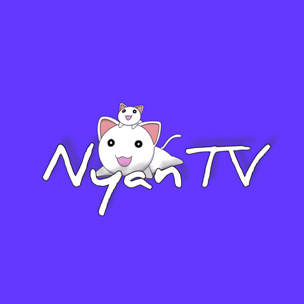

   
  

  <!---->
<!--  -->

# NyanTV: Multi-Service Tracking Client

[**NyanTV**](https://nyantv.vercel.app/) is a multi-service tracking client for Android TV. It combines **anime tracking** (via [**AniList**](https://anilist.co/) & [**MyAnimeList**](https://myanimelist.net/)) with **TV show and movie tracking** (through [**Simkl**](https://simkl.com/)) in one seamless interface.

> [!IMPORTANT]  
> **NyanTV is a tracking tool only.** It does not host, provide, distribute, or endorse any streaming content, media, or third-party extensions.
>
> **User Responsibility:** Users are solely responsible for how they use the app and any third-party services or extensions they choose to interact with. Users must comply with all applicable laws, copyright, and intellectual property rights.
>
> **No Liability:** The developers of NyanTV disclaim all liability for misuse, legal issues, or violations arising from user actions. Legal concerns, including DMCA claims, should be directed to the respective third-party services, not NyanTV. The app is provided "as-is" without warranties.
>
> **Services:** NyanTV integrates only with the official APIs of supported services (AniList, MyAnimeList & Simkl). Third-party extensions are the responsibility of their creators, not the NyanTV developers.
>
> **By using NyanTV, you agree to comply with our [Terms of Service](./TOS.md). Please review the ToS to understand our DMCA-compliant, tracking functionality and our non-involvement with any content or services beyond AniList, MyAnimeList and Simkl.**

## Downloads

  

    
  

## Preview

 
<a href="https://github.com/NyanTV/NyanTV/wiki/Screenshots">Static preview</a>

## Upcoming Features
- [x] Watch next widget for Android Home Launcher
- [x] Real-time Subtitle translation

  
Implemented

- [x] Full D-Pad integration

## Wiki

For detailed setup instructions, check out the [Wiki](https://github.com/NyanTV/NyanTV/wiki).

## Support Us

> [!TIP]
> Add your **Discord account** in the **NyanTV settings** to help spread it
>
> ⭐ **Star this repository to support the developer & encourage the development of the app!**
>
> ❤️ Heart this project at [__**miyomi.pages.dev**__](https://miyomi.pages.dev/software/nyantv) (No login required)

  
Star History

  

## Official Communities

Join our community to stay updated and contribute to the discussion:

## Contribute

We welcome contributions, from translations to new features.  
Our development environment setup guide is available [here](./DEVELOPMENT.md).  
For inquiries, join our [Telegram group](https://t.me/NyanSupport) / [Discord server](https://discord.gg/y2vaFPXs4F) / [Stoat server](https://stoat.chat/invite/fKzse8yy).  
Pull requests are welcome; check the [open issues](https://github.com/NyanTV/NyanTV/issues) for guidance on major changes.

<!--

Weblate Translation Graph

-->

## Visitors

## Acknowledgments

A heartfelt thank you to everyone who has contributed to the development of NyanTV.
Your efforts are invaluable.

 

## Stats

## License

NyanTV is licensed under the GNU Affero General Public License v3.0 (AGPL-3.0). More info can be found [here](LICENSE.md).

